# Projet de automate

> Nom Francais: Abigail 
>
> Nom Chinoise: JUNYI LU
>


# Content

[TOC]

# 1.Introduction

> Les commentaires dans le code sont en chinois pour faciliter la programmation, mais les variables et fonctions les plus importantes sont expliquées en français dans le rapport.
>
> Les noms de variables et les rapports d'erreurs dans le code, et les journaux sont en anglais, ceci parce que le français contient des caractères spéciaux qui ne sont pas pratiques à utiliser.
>
> Le rapport et le README sont écrits en français.


Avant de lancer l'ensemble du projet, j'ai défini dans `analyse_lexical.h` un certain nombre de variables globales.

```c
char targetfile[64];//Stockage du nom du fichier cible( par example: Zpile.txt)

//Vous pouvez voir leur fonction à partir des noms des variables suivantes
int numStatus=0;
int numStatusFinal=0;
int numTransitions=0;
int numStacks=0;

STATUS statusList[10];//Stocke les informations sur l'état de l'automate (nom, index, adresse dans VM.txt)
char triggerList[10];//Stockage des caractères dont l'état de stimulus a changé
int index_status_initial=0;
int index_status_final[10];
TRANSITION transList[10];//Stocke toutes les changement de l'états définies dans le fichier cible
```

Ces variables sont très importantes et leur manipulation est effectuée pendant toutes les phases du projet.

Je les ai définies globalement car cela évite de passer des variables dans des phases adjacentes, par exemple, je peux introduire et utiliser ces variables en écrivant `#include "analyse_lexical.h"` au début de `analyse_syntax.h`

Puisque l'analyse lexicale doit être faite avant l'analyse syntaxique, et que l'analyse lexicale et l'analyse syntaxique doivent être faites avant l'analyse sémantique... J'ai choisi d'envelopper le code qui met en œuvre ces analyses dans des fonctions, écrites dans un fichier d'en-tête qui peut être facilement appelé à d'autres étapes.

Le débogage des fonctions se fera au moyen d'un programme de test dans le dossier `src`.


# 2.Analyse lexicale

## 2.1.Explication générale

### Definition de variables

Les variables globales suivantes ne seront utilisées que dans la section d'analyse lexicale

```c
char str[1024];//Stocke la chaîne de caractères lue à partir du fichier cible (pas de commentaires, pas de coupures d'espace).
int strlength=0; 	

char ch;//Caractère actuel
int ch_index_in_str=0;//Index du caractère actuel dans str
int syn;// Code d'identification du caractère courant

char token[20];//Mot réservé actuel de str
int ch_index_in_token=0;//Pointeur actuel du Mot réservé

char chinese_token[4];//Caractères chinois courants et caractères spéciaux récupérés dans str
int ch_index_in_chinesetoken=0;//Pointeur actuel du chinese_token
```

- J'ai fait quelques erreurs avec le nommage de `chinese_token` , après de nombreux tests, j'ai réalisé que le caractères spéciaux → doivent être sauvegardés avec 3 char et un `'\0'`,  comme les caractères chinois, mais je n'ai pas trouvé de meilleur nom, donc j'ai opté pour ce nommage, donc vous pouvez voir que il y a un '→' dans la liste:

  `static char * chinese[12]={"零","一","二","三","四","五","六","七","八","九","十","→"};`

- J'aurais aimé implémenter la reconnaissance des états nommés avec des caractères français spéciaux, mais j'ai trouvé cela très délicat et j'ai été contraint par des contraintes de temps de ne pas implémenter cette fonctionnalité.
- Si un nombre est utilisé comme nom d'un état et d'un trigger, il ne sera pas reconnu comme un id, ce problème sera corrigé dans `analyse_syntax`.

### Tableau des codes d'identification

| Caractère   | Code d'identification | Caractère | Code d'identification |
| ----------- | --------------------- | --------- | --------------------- |
| Automate    | 1                     | [         | 23                    |
| etats       | 2                     | ]         | 24                    |
| initial     | 3                     | {         | 25                    |
| final       | 4                     | }         | 26                    |
| transitions | 5                     | ,         | 27                    |
| id          | 10                    | `         | 28                    |
| digit       | 11                    | "         | 29                    |
| (           | 21                    |           |                       |
| )           | 22                    | =         | 31                    |
|             |                       | →         | 32                    |

### Ideé

D'abord, je lis le contenu du fichier dans str et j'élimine le contenu du commentaire en identifiant le début et la fin du commentaire et en réécrivant le bit de drapeau.

Je vérifie ensuite les caractères **un par un**, d'abord pour voir si la forme `int` du caractère est **négative**( car un nombre négatif signifie que le caractère et les deux caractères suivants représentent un caractère spécial) ; ensuite pour déterminer si le caractère représente une lettre, un chiffre ou un symbole.

Si le caractère représente une lettre, vérifiez qu'il ne forme pas, avec les caractères qui le suivent, un mot réservé.

- Si c'est le cas, on lui attribue l'identifiant correspondant.
- Dans le cas contraire, le caractère est considéré comme un id (l'id est le nom que l'utilisateur donne à l'état ou au trigger) et se voit attribuer l'identifiant correspondant.

Si un caractère et ses deux suivants représentent des caractères spéciaux, il y a deux possibilités.
- Le caractère spécial est un caractère chinois et doit donc recevoir l'identifiant de id：10 , car les exigences du projet indiquent que les caractères chinois ne seront utilisés que pour la dénomination des états
 - Le caractère est →, on lui donne donc l'identifiant correspondant.

Je fais cela pour faciliter l'étape suivante de l'analyse syntaxique, et aussi pour lancer une erreur lexicale si je tombe sur un caractère qui n'a pas été défini.


## 2.2.Fonctions

`isletter()`:Cette fonction est utilisée pour identifier si un caractère est une lettre ou non.

`isDigit()`:Cette fonction est utilisée pour identifier si un caractère est un nombre ou non.

`isBoundary()`:Cette fonction est utilisée pour identifier si un caractère est un symbole ou non.

`readin_without_comment()`:Cette fonction est utilisée pour supprimer les commentaires et les espaces du fichier cible et stocker les informations utiles dans str.

`analyse_lexical()`:C'est la principale fonction utilisée pour l'analyse lexicale.


## 2.3.Difficulté & Solution

J'ai des difficultés à analyser les caractères spéciaux et les mots réservés.

Premièrement, les caractères spéciaux et les mots réservés sont représentés par des combinaisons de plusieurs caractères, ce qui m'a obligé à trouver une nouvelle logique de jugement.

Deuxièmement, les caractères spéciaux sont représentés d'une manière très spéciale. En C, les caractères spéciaux semblent être conservés sous forme de `string` , puisque les caractères spéciaux sont représentés par trois caractères et un` '\0'` .

Enfin, j'ai choisi de traiter les caractères spéciaux et les mots réservés comme des `string`, sauvegardées avec `static char * table[]`, et j'ai utilisé `strcmp` pour les comparer avec ce qui était lu.


# 3.Analyse Syntaxique

## 3.1.Explication générale

En analyse syntaxique, mon idée principale est la suivante：

- Il faut d'abord analyser un caractère (ou un caractère spécial/mot réservé) avec la fonction `analyse_lexcial`  pour obtenir l'identifiant, puis analyser si cet identifiant apparaît à la bonne position, et s'il est correct, stocker l'information sur l'automate porté par ce caractère dans la variable globale correspondante, ou lancer un avertissement d'erreur de syntaxe s'il est incorrect.
- Continuez ensuite à analyser le caractère suivant avec la fonction analyse_lexcial et répétez ce qui précède jusqu'à ce que la fin de `str`  soit lue.

Malgré la simplicité de l'idée d'implémentation, la quantité de travail impliquée est énorme et on peut écrire un code extrêmement complexe et difficile à comprendre si l'on ne fait pas attention. Pour rendre la structure du code plus claire, j'ai encapsulé l'analyse des chaînes locales dans des fonctions plus petites et les ai ensuite appelées dans les fonctions d'analyse pour les chaînes plus grandes... jusqu'à la fonction principale `analyse_synatax()` .

## 3.2.Fonctions

`errorinfo()`:Cette fonction est conçue pour lancer un avertissement d'erreur de syntaxe

`analyse_ syntax()`：Cette fonction est la principale fonction d'analyse syntaxique.

- `etats statement()`: Cette fonction est conçue pour analyser des instructions comme `etats =["一","二","三"]`

  - `st()`: Cette fonction est conçue pour analyser des instructions comme `"一"`

- `initialstatement()`: Cette fonction est conçue pour analyser des instructions comme `initial= 0`

- `final_statement()`: Cette fonction est conçue pour analyser des instructions comme `final =[1]`

- `transitions_statement()`: Cette fonction est conçue pour analyser des instructions comme:

  ```c
  	transitions=[(0 → 0, `a`, (→,`a`)), 
  		(0 → 1, `b`, (`a`, →),(→, `b`)),
  		(1 → 1, `b`, (`a`, →), (→,`b`)),
  		(1 → 2, `c`, (), (`b`, → )), 
  		(2 → 2, `c`,(), (`b`, →))]
  ```

  - `trans()`: Cette fonction est conçue pour analyser des instructions comme``(0 → 1, `b`, (`a`, →),(→, `b`))``

    - `srcdst()`Cette fonction est conçue pour analyser des instructions comme `0 → 1`
    - `trig()`Cette fonction est conçue pour analyser des instructions comme\`b`

    - `st_action2()` et `st_action1()`:Cette fonction est conçue pour analyser des instructions comme``(`a`, →)``et` `et`()`

`print_ syn_result()` :Cette fonction est conçue pour imprimer les résultats de l'analyse syntaxique.


## 3.3.Difficulté & Solution

- J'ai été inspiré par cet [article]( https://blog.csdn.net/xiaoyuge16/article/details/51581260) en termes de réflexion globale

- Après de nombreux bugs，J'ai trouvé un moyen très simple de convertir un char en int  ASCII correspandant：

  ```c
  index_status_initial=ch-'0';//Ici index_status_initial est de type int， ch est de type char
  ```


## 3.4.Limitation

1. Puisqu'il y a tellement d'endroits pour lancer des avertissements d'erreur de syntaxe, je n'ai pas eu l'énergie d'écrire la cause de chacun d'entre eux, donc j'ai simplement défini une fonction de lancement d'avertissement,` errorinfo()` , qui est appelée chaque fois qu'un avertissement est nécessaire.

2. Mon code comporte trop de couches de structures de jugement if-else imbriquées, ce qui entraîne une mauvaise lisibilité. J'ai réfléchi à la manière de résoudre ce problème, et en faisant des recherches sur le web, j'ai découvert que ce problème est courant en ` java`  et qu'il peut être résolu en écrivant  [` garde`](https://fr.wikipedia.org/wiki/Garde_(informatique)) , mais j'ai été contraint par le manque d'énergie de mener à bien la tâche de refactoring du code.

   Plus tard, je prévois de lire quelques livres pour m'aider à écrire un code plus lisible, moins répétitif et plus standard.


## 3.5. Resultat

Lorsque la pile est vide, printf imprime le \0 à l'intérieur, un symbole non reconnu par le système d'encodage UTF-8, et donc un rappel que `testsyn_result.log ` n'est pas reconnu

`Zpile.txt` :

```
Status: 1
Status: 2
Status: 3
Status: Init
numStacks: 0
index_status_initial: 3
index_status_final: 0
index_status_final: 1
index_status_final: 2
from:3,	to:0,	trigger:0,
stack1:�,	action1:0,	stack2:�,	action2:0

from:3,	to:1,	trigger:1,
stack1:�,	action1:0,	stack2:�,	action2:0

from:3,	to:2,	trigger:2,
stack1:�,	action1:0,	stack2:�,	action2:0

from:0,	to:1,	trigger:1,
stack1:�,	action1:0,	stack2:�,	action2:0

from:0,	to:2,	trigger:2,
stack1:�,	action1:0,	stack2:�,	action2:0

from:1,	to:0,	trigger:0,
stack1:�,	action1:0,	stack2:�,	action2:0

from:1,	to:2,	trigger:2,
stack1:�,	action1:0,	stack2:�,	action2:0

from:2,	to:0,	trigger:0,
stack1:�,	action1:0,	stack2:�,	action2:0

from:2,	to:1,	trigger:1,
stack1:�,	action1:0,	stack2:�,	action2:0
```

`Upile.txt `:

```
Status: 一
Status: 二
Status: 三
numStacks: 1
index_status_initial: 0
index_status_final: 1
from:0,	to:0,	trigger:a,
stack1:a,	action1:1,	stack2:�,	action2:0

from:0,	to:1,	trigger:b,
stack1:a,	action1:-1,	stack2:�,	action2:0

from:2,	to:1,	trigger:b,
stack1:a,	action1:-1,	stack2:�,	action2:0

from:0,	to:2,	trigger:c,
stack1:�,	action1:0,	stack2:�,	action2:0

from:2,	to:2,	trigger:c,
stack1:�,	action1:0,	stack2:�,	action2:0

from:1,	to:1,	trigger:b,
stack1:a,	action1:-1,	stack2:�,	action2:0
```

`Dpile.txt `:

```
Status: A
Status: B
Status: C
numStacks: 2
index_status_initial: 0
index_status_final: 2
from:0,	to:0,	trigger:a,
stack1:a,	action1:1,	stack2:�,	action2:0

from:0,	to:1,	trigger:b,
stack1:a,	action1:-1,	stack2:b,	action2:1

from:1,	to:1,	trigger:b,
stack1:a,	action1:-1,	stack2:b,	action2:1

from:1,	to:2,	trigger:c,
stack1:�,	action1:0,	stack2:b,	action2:-1

from:2,	to:2,	trigger:c,
stack1:�,	action1:0,	stack2:b,	action2:-1
```


# 4.Analyse Semantique

Cette partie est très simple, il suffit de vérifier que les valeurs des variables globales obtenues après l'analyse syntaxique ne sont pas en conflit les unes avec les autres


# 5.Compilation

## 5.1.Explication générale

​	Dans cette section, je dois sortir les informations que j'ai obtenues précédemment dans un certain ordre，je dois donc regrouper les transitions en fonction de leur état de départ, ce qui nécessite que je puisse obtenir d'autres informations sur une transition en fonction de son index, ce qui serait très simple si j'utilisais C++ : je pourrais définir une classe de transitions qui contient de telles fonctions de requête. Mais en C, il n'y a pas de concept de classe, donc j'ai défini quelques fonctions pour le faire：

```
search_address_given_index (int)
search_index_given_address(int)
search_name_given_index(int)
search_name_given_address(int)
```

​	Puisque ce qui est écrit dans VM.txt et TS.txt doit être l'adresse de l'état dans VM.txt, et non l'index qu'il a obtenu lorsqu'il a été défini, j'ai besoin de savoir à quelle position un état doit être écrit dans VM.txt, ce qui est compliqué, donc j'écris VM.txt la première fois en écrivant l'index de l'état, puis en stockant sa position actuelle(avec fonction `transition_ info_ from (int)`), puis j'écris VM.txt à nouveau, cette fois avec l'état à son adresse(avec fonction `update_ transition_ info_ from(int)`).


## 5.2.Limitation

Bien qu'initialement le `trigger`, ` target_trigger_stack`  puisse être défini sur un caractère spécial ou plusieurs caractères, seul un caractère commun unique tel que a,b,c,1,2,3 est pris en compte dans la sortie de la VM.txt.


## 5.3.Resultat

`Zpiel.txt`:

```c
0 3 3 
6 11 16 //l'adress dans VM.txt de l'etats 1,2,3 est 6 11 16
2 49 11 50 16 // A partir de l'etats 1
2 48 6 50 16 // A partir de l'etats 2
2 48 6 49 11 // A partir de l'etats 3
3 48 6 49 11 50 16 // A partir de l'etats Init
```

`Upile.txt`:

```c
1 0 1 
17 //l'adress dans VM.txt de l'etats 二 est 17
3 97 4 97 1 98 17 97 -1 99 22 0 0 // A partir de l'etats 一
1 98 17 97 -1 // A partir de l'etats 二
2 98 17 97 -1 99 22 0 0 // A partir de l'etats 三
```

`Dpile.txt`:

```c
2 0 1 
30 //l'adress dans VM.txt de l'etats C est 30
2 97 4 97 1 0 0 98 17 97 -1 98 1 // A partir de l'etats A
2 98 17 97 -1 98 1 99 30 0 0 98 -1 // A partir de l'etats B
1 99 30 0 0 98 -1 // A partir de l'etats C
```


# 6.Execution

## 6.1.Explication générale

​	Dans cette section, je dois faire en sorte que l'automate exécute une chaîne d'entrée donneé par utilisateur, consistant par trigger, et voir si l'automate peut atteindre l'état d' acception avec cette chaîne.Dans cette section, j'utilise la structure myStack définie précédemment:

```C
myStack * stack1;
myStack * stack2;
```

​	J'analyse chaque caractère un par un, et si le caractère peut déplacer l'état actuel vers l'état suivant, je saute à cet état dans `vminfo[]` , puis j'analyse le caractère suivant et je répète ce qui précède, en envoyant un message d'erreur s'il n'y a pas d'état vers lequel sauter, ou si la pile est déjà vide mais que la pile doit être vidée ensuite, ou si on ne peut pas aller à l'état d‘acception  en fonction de la chaîne lue.

​	J'ai écrit deux fonctions, une qui imprime des informations de debug `execute()` et une qui ne le fait pas `execute_without_debug()`. Dans `main.c`, je contrôle quelle fonction est utilisée en définissant la macro  `debug` :

```c
#ifdef debug
    execute();
#else
    execute_without_debug();
#endif
```

 j'ai écrit les règles dans le `Makefile `:

```make
ifeq ($(debug),yes)
DEBUG := -D debug
endif
```

​	 Il suffit d'ajouter : `debug:=yes` à la compilation pour activer le mode de debug, lisez la section README ci-dessous pour plus d'informations.

- `flag_exist`  est utilisé pour vérifier si l'état suivant peut être atteint à partir de l'état actuel en fonction du trigger d'entrée.


## 6.2.Difficulté & Solution

Après avoir écrit le programme et l'avoir compilé, gcc lance une erreur.

`Segmentation fault (core dumped)`

Cette erreur est généralement causée par un pointeur pointant vers une mauvaise zone de mémoire, ce qui est une erreur fatale et difficile à dépanner, et comme je ne pouvais pas configurer le debugger de VScode, je ne pouvais la dépanner qu'en insérant des `printf ` dans le code, et après une après-midi de debug, j'ai finalement trouvé que la cause de l'erreur était que je n'avais pas alloué de mémoire pour `stack1`  et `stack2 `!

Ainsi, après avoir ajouté ces deux lignes de code, le programme fonctionne bien.

```c
    stack1=(struct myStack*)malloc(sizeof(struct myStack));
    stack2=(struct myStack*)malloc(sizeof(struct myStack));
```


## 6.3.Limitation

En raison de contraintes de temps, je n'ai pas pu séparer le processus de compilation du processus d'exécution, ce que je n'aurais pas dû pouvoir faire. Théoriquement, VM.txt et TS.txt sont équivalents aux fichiers cibles binaires compilés par le programme, et j'aurais pu exécuter l'automate sur la base des seules informations contenues dans ces deux fichiers.


------


# README

- J'ai installé une machine virtuelle `Ubunt20.04LTS` dans `Vmware 15.5Pro` sur un ordinateur `Win10` ,  et j'ai utilisé `Remote-SSH` de `Visual Studio Code` pour accéder à cette machine virtuelle à distance depuis un autre `Macbook`  pour des travaux de développement.
- J'ai compilé avec `GCC`  et debug avec `GDB`.

- Environment:

  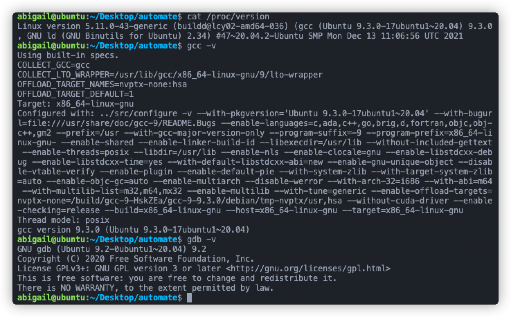

## Structure de dossier

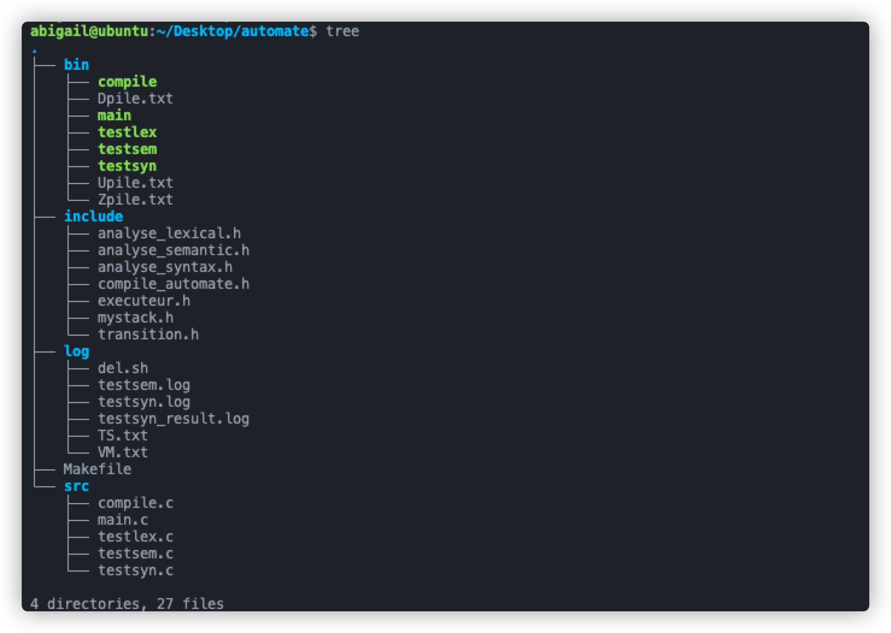

Le dossier `bin` contient les **fichiers exécutables compilés** et les fichiers Dpile.txt, Upile.txt et Zpile.txt.

Le dossier `include` contient les **fichiers d'en-tête** utilisés dans le projet, dont

- `mystack.h` définit une **structure de pile** et des fonctions associées à appeler lorsque nous rencontrons un automate de pile
- `transition.h` définit une **structure de transition** et une **structure d'état** pour stocker les informations lues dans Dpile.txt, Upile.txt et Zpile.txt.
- Les autres fichiers d'en-tête définissent les fonctions nécessaires à chaque processus de compilation et execution.

Le dossier `log` contient les **journaux** générés lors de l'exécution de l'exécutable, dont le nom vous indiquera quelle phase a généré le journal

Le dossier` src` contient des programmes C écrits pour **tester l'effet des fonctions** à chaque étape de la compilation et execution.

## Comment exécuter le programme

Exécutez `make all` dans le dossier `automate` pour compiler tous les fichiers exécutables .

Exécutez `make all debug:=yes` dans le dossier `automate` pour compiler tous les fichiers exécutables et dans le mode debug.

Exécuter `make clean` pour effacer tous les fichiers exécutables.

### Analyse Lexicale

1. Exécutez `make testlex` dans le dossier `automate`.

2. Ouvrez le dossier `bin` et exécutez `. /testlex`
3. Entrez le nom du fichier que vous souhaitez faire analyser, ici , je utilise `Dpile.txt`
4. Ouvrez le dossier `log` pour voir les journaux générés.

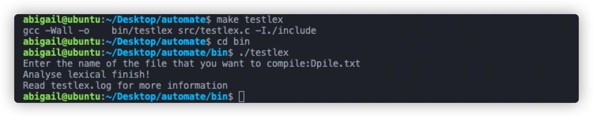

Le fichier `testlex.log` généré à partir de l'analyse lexicale de `Dpile.txt`.

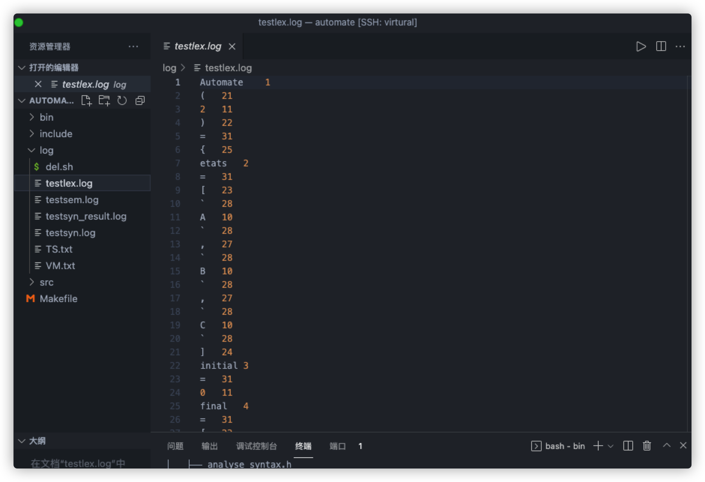


### Analyse Syntaxique

1. Exécutez `make testsyn` dans le dossier `automate`.
2. Ouvrez le dossier `bin` et exécutez `. /testsyn`

3. Entrez le nom du fichier que vous souhaitez faire analyser, ici , je utilise `Dpile.txt`
4. Ouvrez le dossier `log` pour voir les journaux générés.

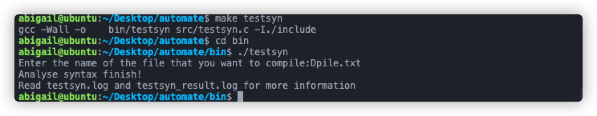

Le fichier `testsyn.log` généré à partir de l'analyse syntaxique de `Dpile.txt`.

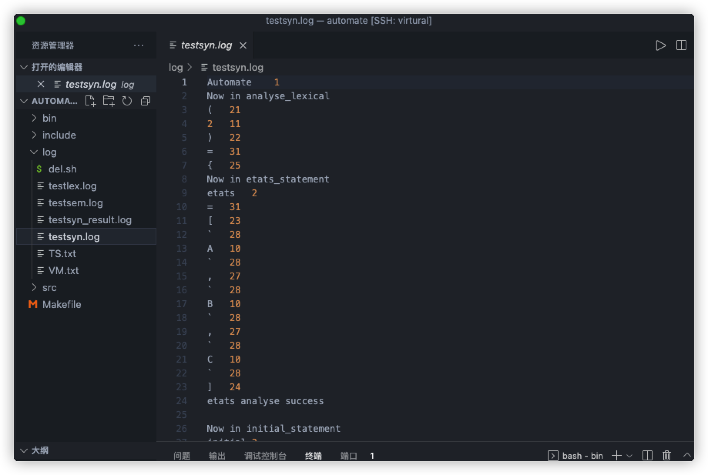

Le fichier `testsyn_result.log` généré à partir de l'analyse syntaxique de `Dpile.txt`.

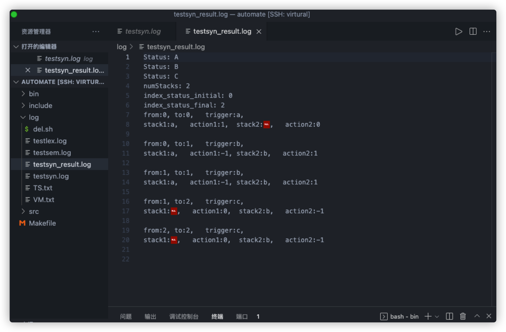


### Analyse Semantique

1. Exécutez `make testsem` dans le dossier `automate`.
2. Ouvrez le dossier `bin` et exécutez `. /testsem`

3. Entrez le nom du fichier que vous souhaitez faire analyser, ici , je utilise `Dpile.txt`
4. Ouvrez le dossier `log` pour voir les journaux générés.

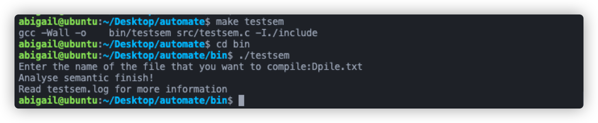

Le fichier `testsem.log` généré à partir de l'analyse semantique de `Dpile.txt`.

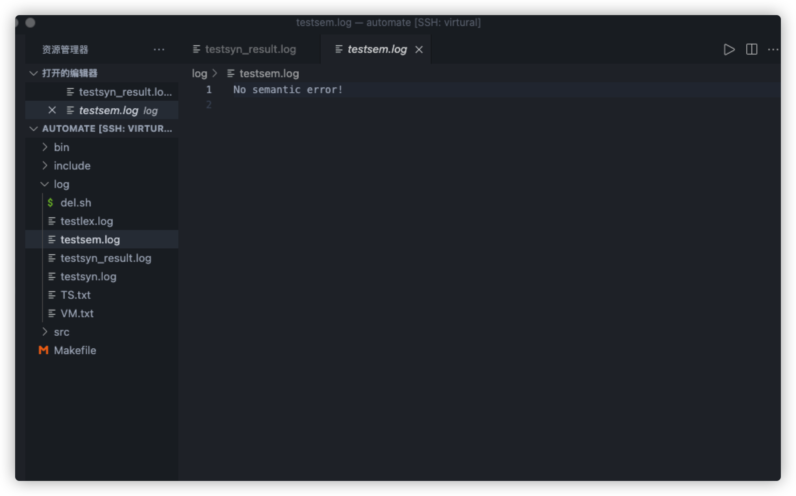


### Compilation

1. Exécutez `make compile` dans le dossier `automate`.
2. Ouvrez le dossier `bin` et exécutez `. /compile`

3. Entrez le nom du fichier que vous souhaitez faire analyser, ici , je utilise `Dpile.txt`
4. Ouvrez le dossier `log` pour voir les journaux générés.

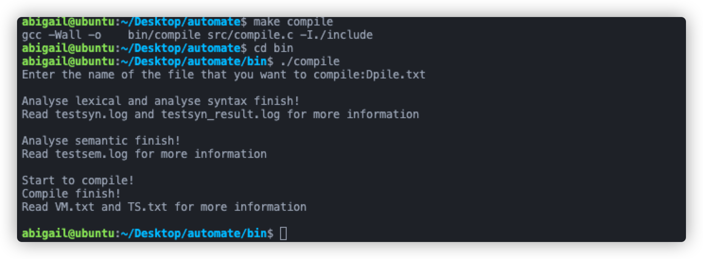

Le fichier `VM.txt` généré à partir du compilation de `Dpile.txt`.

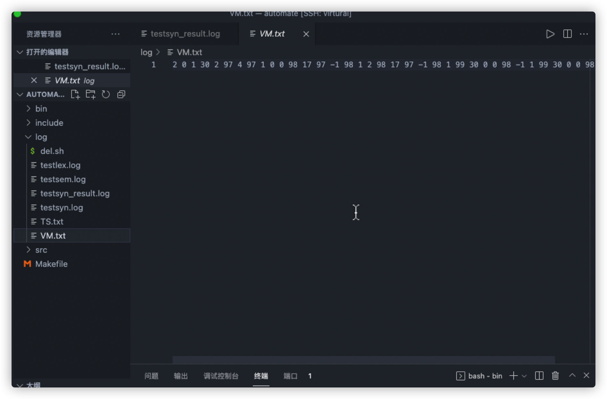

Le fichier `TS.txt` généré à partir du compilation de `Dpile.txt`.

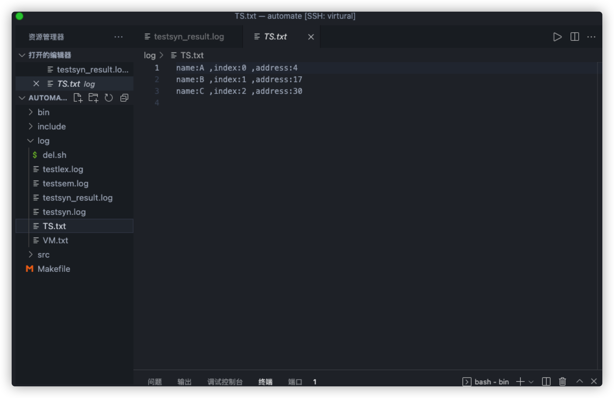


### Execution

1. Exécutez `make main` dans le dossier `automate`.
   - **Exécutez `make main debug:=yes` dans le dossier `automate` si vous voulez être en mode debug**
2. Ouvrez le dossier `bin` et exécutez `./main`

3. Entrez le nom du fichier que vous souhaitez faire analyser, ici , je utilise `Dpile.txt`

Le mot d'entré est:`abc`

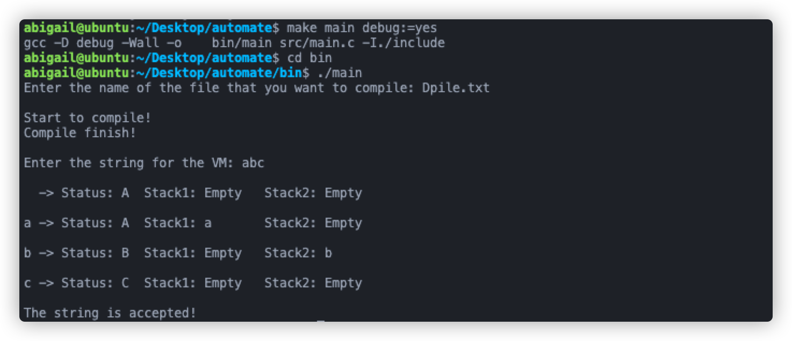

Le mot d'entré est:`aaabbc`

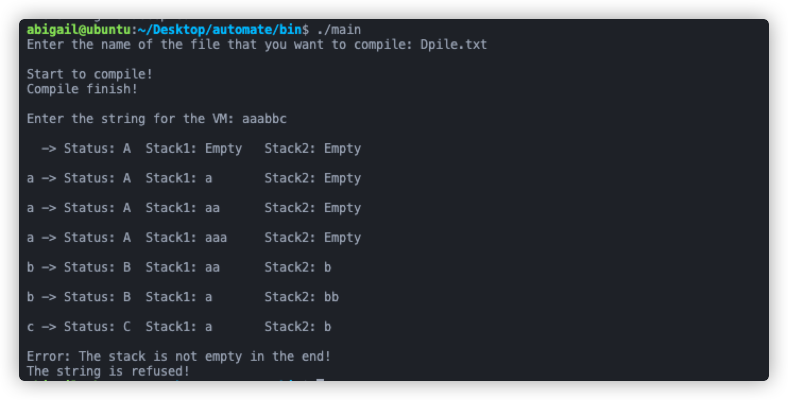

 Je utilise `Zpile.txt`, Le mot d'entré est:`1112211`

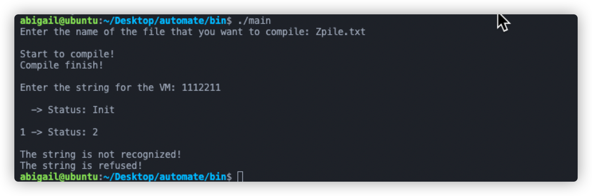

 Je utilise `Zpile.txt`, Le mot d'entré est:`1212`

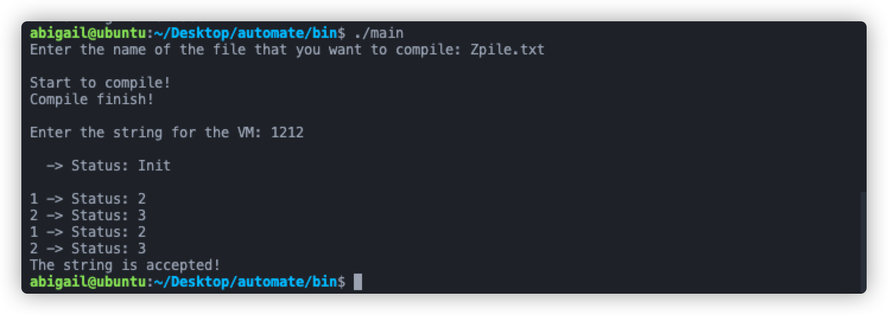

 Je utilise `Upile.txt`, Le mot d'entré est:`aabbbaa`:

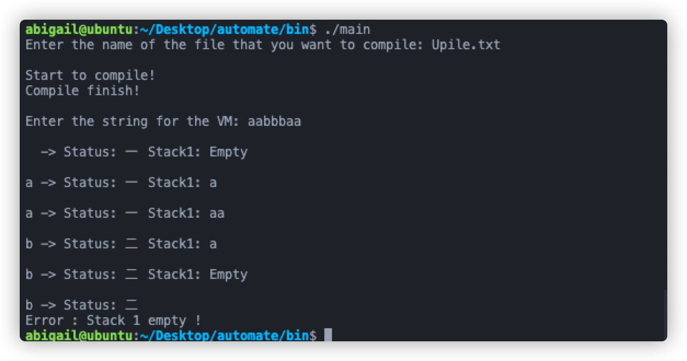
